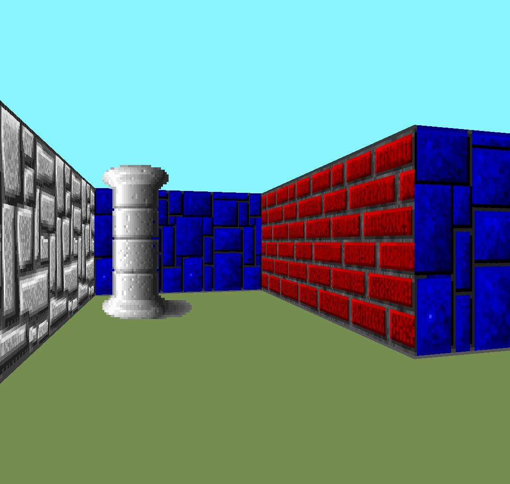

# cub3D

The goal of this 42 project was to create a 3D maze in C using ray-casting techniques to create a game engine similar to the one of Wolfenstein3D.




https://github.com/foucherjocelyn/cub3D/assets/46556978/d05667a5-3fbc-49e9-9493-67f70e065c66


## Usage

Build the project, by executing the Makefile in the root folder with :

```
make
```

Run the executable with the path to a map :

```
./cub3D maps/simple.cub
```

### Controls

- Use ``W``, ``A``, ``S``, ``D`` to move.
- Use the ``left`` and ``right`` arrow key to rotate.
- Use ``Esc`` to quit.
